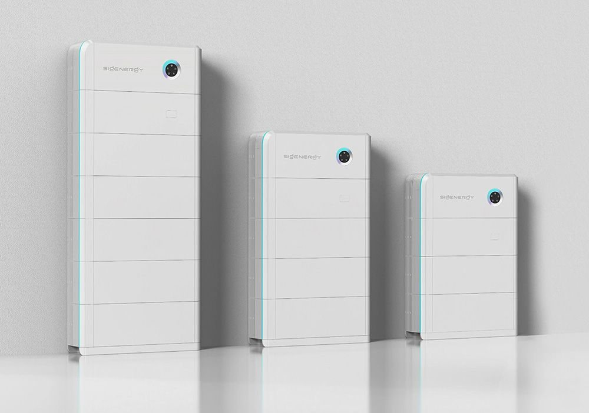

# Eltis Services — website

Moderne, conversiegerichte website voor Eltis Services (thuisbatterijen & laadpalen).
Volledig statisch, opgebouwd uit **losse HTML-pagina's** — klaar voor GitHub Pages en eenvoudig uit te breiden.

## Structuur

```
/
├── index.html              # Home (met offertecalculator)
├── thuisbatterij.html      # Dienstpagina thuisbatterij (hoofdfocus)
├── laadpalen.html          # Dienstpagina laadpalen
├── werkwijze.html          # Werkwijze / stappenplan
├── over-ons.html           # Over Eltis Services + werkgebied
├── blog.html               # Blogoverzicht
├── contact.html            # Contact + contactformulier
├── offerte.html            # Offertepagina (volledige calculator)
├── privacy.html            # Privacyverklaring
├── 404.html                # Foutpagina
├── blog/
│   ├── thuisbatterij-kosten-2026.html
│   ├── salderingsregeling-stopt-2027.html
│   └── laadpaal-1-fase-of-3-fase.html
├── css/style.css           # Volledig designsysteem
├── js/main.js              # Navigatie, animaties, tellers
├── js/calculator.js        # Stapsgewijze offertecalculator
├── assets/                 # Logo + favicon
├── sitemap.xml, robots.txt, llms.txt, .nojekyll
```

## Online zetten via GitHub Pages

1. Maak een nieuwe repository (bv. `eltis-website`) en upload de inhoud van deze map naar de **root** van de repo.
2. Ga naar **Settings → Pages**.
3. Kies bij *Source*: **Deploy from a branch**, branch `main`, folder `/root`.
4. Klaar. Je site staat na een minuut online.
5. Eigen domein? Voeg onder *Pages → Custom domain* je domein toe (bv. `eltisservices.nl`) en maak in je DNS de bijbehorende records aan. GitHub maakt dan automatisch een `CNAME`-bestand.

Elke pagina is een los bestand: je kunt ze afzonderlijk aanpassen en committen.

## Nog even instellen (belangrijk)

Deze zaken zijn ingevuld met **voorbeeldwaarden** — vervang ze door je eigen gegevens:

| Wat | Waar |
|-----|------|
| E-mailadres | `js/calculator.js` (`CONTACT_EMAIL`) + zoek/vervang `info@eltisservices.nl` in alle bestanden |
| Telefoonnummer | zoek/vervang `06 12 34 56 78` en `+31612345678` |
| Werkgebied / plaatsen | zoek/vervang `Amersfoort` en de pillslijst in `over-ons.html` |
| KvK-nummer | `KVK` in de HTML-footer (staat op `00000000`) |
| Domein | zoek/vervang `https://eltisservices.nl` (voor canonicals & sitemap) |

### Reviews & bedrijfscijfers
De klantreviews zijn verwijderd. De statistieken tonen nu alleen onderbouwbare punten (gebundelde expertise, gemiddelde fabrieksgarantie, reactietijd, NEN-norm). Wil je later echte beoordelingen tonen (bijvoorbeeld je Google-score), laat het weten.

### Foto's van thuisbatterij en laadpaal
Op de dienstpagina's staan nu strakke illustraties. Voor een professionele uitstraling werken **eigen foto's van uitgevoerde installaties** het best — die zijn 100% van jou en stralen vertrouwen uit. Een foto van een specifiek merk (bijv. een bekende thuisbatterij of laadpaal) mag alleen als je daar de rechten voor hebt; vraag het beeldmateriaal desgewenst op bij je leverancier/fabrikant.

Een illustratie vervangen door een foto: zet je afbeelding in de map `assets/` (bijv. `assets/thuisbatterij.jpg`) en vervang in het betreffende HTML-bestand het `<div class="media-panel">…</div>`-blok door:
```html
<div class="media-panel" style="padding:0;overflow:hidden">
  
</div>
```
Stuur je mij de foto's, dan plaats ik ze netjes voor je.

## Offertecalculator koppelen aan je mailbox

De calculator werkt out-of-the-box (met een e-mail-fallback). Om aanvragen automatisch binnen te krijgen:

1. Maak gratis een form aan op [Formspree](https://formspree.io) → je krijgt een endpoint zoals `https://formspree.io/f/xxxxxxx`.
2. Open `js/calculator.js` en zet je endpoint bij `FORMSPREE_ENDPOINT`.
3. Doe hetzelfde voor het contactformulier: vervang in `contact.html` de `action="https://formspree.io/f/JOUW_ID"`.

Zonder endpoint toont de calculator een bevestiging plus een knop om de aanvraag als e-mail te versturen.

## Pagina's aanpassen of toevoegen

De HTML is met een klein Python-script gegenereerd zodat header/footer overal identiek zijn.
Je hoeft dit **niet** te gebruiken — de HTML-bestanden zijn volledig zelfstandig en direct te bewerken.
Wil je het toch gebruiken voor consistentie: `build_base.py` bevat de gedeelde onderdelen, `build_pages.py` en `build_extra.py` de pagina's. Draai `python3 build_pages.py && python3 build_extra.py && python3 gen_seo.py`.
(De `build_*.py`- en `gen_seo.py`-bestanden hoeven niet mee naar je live-server.)

## Design in het kort
- **Kleur:** diep marineblauw + warm amber (energie/premium) met koele cyaan-steunkleur.
- **Type:** Space Grotesk (display), Manrope (tekst), JetBrains Mono (data/labels).
- **Signatuur:** het "laadmeter"-motief (charge gauge) — o.a. de voortgangsbalk van de calculator.
- Volledig responsive, toegankelijk (focus states, reduced-motion), en SEO-klaar (schema.org, canonicals, sitemap, llms.txt).
